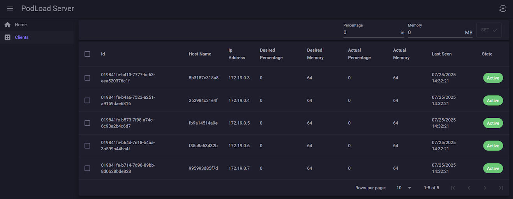

# Pod-Load-Simulator

## Description
A simple client-server application that allows to simulate CPU and memory utilization on clients (e.g. running as k8s pods, thus the name)

Clients are displayed and can be configured via simple UI on the server

## Build and run

With docker installed launch docker-compose using the command

`docker compose -f src/compose.yaml up -d`

This will build the images and launch a server with 5 clients. Images are built using the multistage Dockerfiles no extra dependencies are required.

Kubernetes specs are available [here](k8s/)

